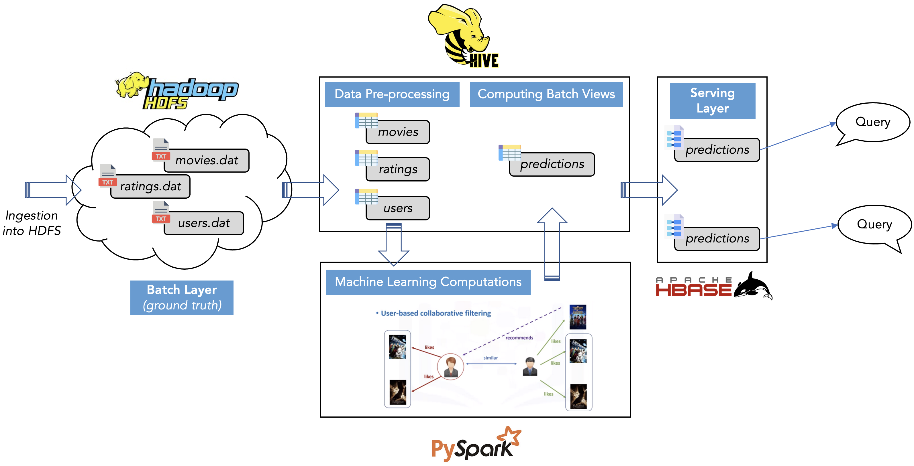

# Big Data Movie Recommendation App

This project was completed as a final project for University of Chicago's Big Data Application Architecture course (MPCS 53014), taught in Fall 2022 by Mike Spertus

## Overview

This project is a toy implementation of a lambda architecture using the Apache stack. The movie recommendation engine built in this application aims to apply Machine Learning techniques to a large dataset of user movie ratings (> 1M ratings) from the database to suggest the top 10 best movies a user might want to watch next, based on their prior ratings and similarity to other users.

**Data Used:** [MovieLens 1M Dataset](https://grouplens.org/datasets/movielens/1m) published by GroupLens

**Machine Learning Algorithm used:** SparkML’s ALS Machine Learning algorithm (that uses Collaborative Filtering)

**Languages/Platforms used:** Hadoop DFS, HBase, HiveQL, Spark (PySpark, SparkML), Java, Node.js (see Technical Implementation section below for details)

**Final Prediction:** A user's rating for a new movie based on ratings they have already given to movies they have watched. Based on this the top 10 best movies a user might want to watch are suggested.

## Data

The details of the datasets used are below:

1. `ratings.dat` contains movies with their ratings by user (3952 movies x 6040 users)
    a. UserIDs range between 1 and 6040
    b. MovieIDs range between 1 and 3952
    c. Ratings are scored on a 5-star scale (whole-star ratings only)
    d. Timestamp is represented till seconds
    e. Each user has at least 20 ratings

2. `movies.dat` contains variables describing the movies:
    a. Titles are identical to titles provided by the IMDB (including the year of release)
    b. There are 18 unique genres in total, and for each movie, the associated genres are pipeseparated (Eg: [ Action | Adventure | Comedy ])
    c. Some MovieIDs do not correspond to a movie due to accidental duplicate entries and/or test entries

3. `users.dat` contains details about the users:
    a. Gender is denoted by “M” for male and “F” for female
    b. Age (chosen from brackets of “Under 18”, “18-24”, …, “50-55”, “56+”)
    c. Occupation (chosen from 20 occupations)

All three files are available as `.dat` files where columns are separated by ‘`::`’

## Project Structure

Quick summary of the contents of this repo:

```
.
├── 01-batch-layer: Ingests data into HDFS and converts it into ORC format
├── 02-ML-recommendation-model: Uses Collaborative Filtering to predict user ratings
├── 03-serving-layer: Computes views in HBase as key-value stores
├── 04-webapp: Lets user query final HBase serving layer views
├── data: Datasets used for the project
└── img: Screenshots of the front-end webapp
```

## Technical Implementation

Diagram below explains flow of data and back-end big data architecture of the app:



### Batch Layer

The Batch Layer contains the Master Datasets (ground truth). It is scalable (so it can be used even with MovieLens’ 25M and 1B datasets), immutable, and allows for efficient scans.

From within the HIVE shell, ORC tables for Ratings, Movies and Users are created.

### ML Model

The Hive ORC tables are then accessed from within the PySpark shell for use in ML algorithms.

A brief overview of the main algorithm (ALS from SparkML) and what it does is presented below:

Collaborative filtering calculates recommendations based on similarities between users and products. For example, collaborative filtering assumes that users who give similar ratings on the same movies will also have similar opinions on movies they haven't seen.

The alternating least squares (ALS) algorithm provides collaborative filtering between users and products to find products that the customers might like based on their previous ratings.

In this case, the ALS algorithm will create a matrix of all users versus all movies. Most cells in the matrix will be empty. An empty cell means the user hasn't reviewed the movie yet. The ALS algorithm will fill in the probable (predicted) ratings based on similarities between user ratings. The algorithm uses the least squares computation to minimize the estimation errors and alternates between solving for movie and user factors.

The below images procured from [here](https://towardsdatascience.com/introduction-to-recommender-systems-6c66cf15ada) give a good idea about the functioning of the algorithm:


Once the model is built, predictions are made of ratings for all the users in our database, sorted in descending order of their predicted ratings, and top-10 movie recommendations are filtered out. These ten movies per user are then stored in a Spark DataFrame (totaling 60400 rows) and saved to Hive as a batch view to serve to our serving layer.

### Serving Layer

The serving layer hosts precomputed views in HBase as Key-Value stores, containing data from the Hive batch view obtained above.

### WebApp

The front end provides an interface for the user to enter their UserID, based on which the Top-10 recommended movies are suggested as shown below:

1. User enters a userID into the field and clicks on the ‘Submit’ button. Given that there are 6040 users in the database, the value of userID entered must be between 1 and 6040.


2. Once a userID is input, the application publishes the top 10 movies titles and their corresponding genres, along with movieID and userID for reference and cross-checking. Top-10 movie recommendations for a user with userID: `345` are displayed below


## References

1. Pentreath, Dua, Ghotra, *Machine Learning with Spark, 2 Ed.*
2. [Movie recommender system with Spark machine learning](https://danielcaraway.github.io/html/IST718_WK3_ASYNC_movierecommender.html), Victor Hatinguals
3. [Introduction to recommender systems](https://towardsdatascience.com/introduction-to-recommender-systems-6c66cf15ada), Baptiste Rocca

